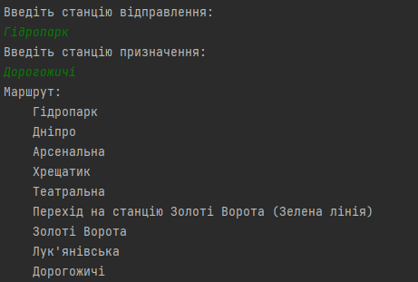
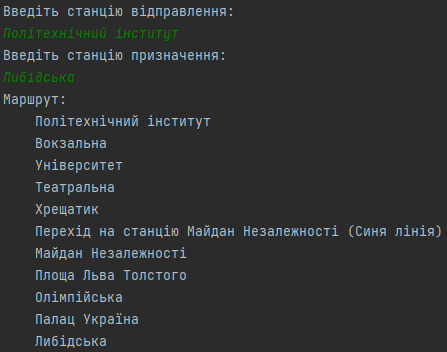

<h1 align="center"><b>Metro Mapper - аналізатор метро</b></h1>

---

## Опис

**Metro Mapper** - проект, заснований на анілізі структури мап метро, що надається в уніфікованій формі. Інтерфейс взаємодії
користувача відбувається в консолі, де він вказує станції початку та кінця маршруту. Система будує найкоротший шлях,
враховуючи всі лінії метро та пересадки.

Проект має **тести**, добре **залогований** та **задокументований**.

---

## Приклади роботи:

---

## Стек бібліотек та технологій
+ Java 17
+ JSON Simple
+ JUnit 4
+ Log4j